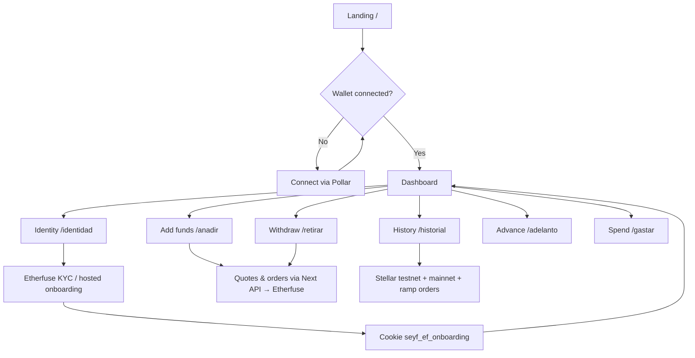
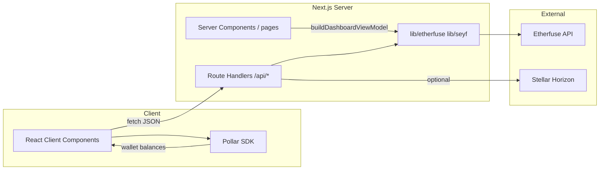
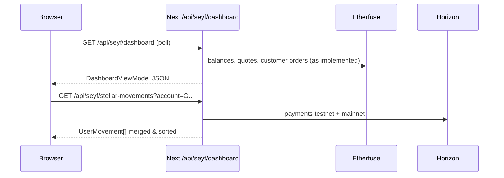

# Seyf App

**Seyf** is a **Next.js** web app for savings, yield-based advances, **fiat ↔ crypto** ramps through **Etherfuse**, and **Stellar** custody / signing via **Pollar** (`@pollar/react`). It targets the Mexican market (MXN, CETES / MXNe, SPEI flows in sandbox).

**Product tagline:** *Buy now, Pay never*.

---

## Table of contents

1. [Product & user flows](#product--user-flows)
2. [System & data flows](#system--data-flows)
3. [Tech stack](#tech-stack)
4. [Requirements](#requirements)
5. [Install & run](#install--run)
6. [Environment variables](#environment-variables)
7. [Application architecture](#application-architecture)
8. [Folder structure](#folder-structure)
9. [Routes](#routes)
10. [Integrations](#integrations)
11. [Internal API (`/api`)](#internal-api-api)
12. [Dashboard, movements & history](#dashboard-movements--history)
13. [Security & production](#security--production)
14. [Scripts](#scripts)
15. [Deployment](#deployment)
16. [External references](#external-references)
17. [Troubleshooting](#troubleshooting)
18. [License & contributing](#license--contributing)

---

## Product & user flows

High-level journey: the user discovers Seyf, connects a Stellar wallet, completes Etherfuse identity when needed, then uses the home dashboard, ramps, advances, and history.



**Step-by-step (conceptual)**

| Step | What happens |
|------|----------------|
| 1 | User opens the app; marketing / entry on `/` or auth on `/login`, `/registro`. |
| 2 | User connects **Pollar** (Stellar wallet). Dashboard shows **MXNe** balance and CETES/stablebond reference when applicable. |
| 3 | For ramps and live CETES valuation, user completes **Etherfuse onboarding** on `/identidad`; server stores an **httpOnly cookie** with ramp context. |
| 4 | User deposits or withdraws through product routes; **Next.js route handlers** call Etherfuse with the **server-side API key**. |
| 5 | **History** merges on-chain payments (**Horizon**, both networks) with **Etherfuse** orders; mock ledger rows are omitted in history. |

---

## System & data flows

How the browser, Next.js, and external services interact for a typical dashboard refresh and for Stellar movements.



**Dashboard polling (simplified sequence)**



---

## Tech stack

| Area | Technology |
|------|------------|
| Framework | **Next.js 16** (App Router) |
| UI | **React 19**, **Tailwind CSS 4**, **Radix UI**, **Framer Motion**, **Lucide** |
| Language | **TypeScript 5.7** |
| Wallet / Stellar (client) | **Pollar** (`@pollar/react`, `@pollar/core`) |
| Stellar (server / tooling) | **@stellar/stellar-sdk** |
| Forms / validation | **react-hook-form**, **Zod** |
| Analytics | **@vercel/analytics** (optional in root layout) |

Sensitive **Etherfuse** calls run in **route handlers** and `lib/` only (API key never shipped to the client bundle for those paths).

---

## Requirements

- **Node.js** 20+ (match your CI / Vercel version).
- **npm** (or pnpm/yarn if you adapt commands).
- **Etherfuse** account and **API key** (sandbox: `api.sand.etherfuse.com`).
- **Pollar** app + publishable key: `NEXT_PUBLIC_POLLAR_API_KEY` (see [Pollar API keys](https://docs.pollar.xyz/docs/getting-started/api-keys)).

---

## Install & run

```bash
git clone <repo-url>
cd seyf-app
npm install
cp .env.example .env.local
# Edit .env.local — see Environment variables

npm run dev
```

Open [http://localhost:3000](http://localhost:3000).

```bash
npm run build          # production build
npm run start          # serve production build
npm run lint           # ESLint
npm run etherfuse:verify   # sanity-check Etherfuse env + API
```

---

## Environment variables

Copy **`.env.example`** → **`.env.local`**. Do not commit secrets.

### Server — Etherfuse & Seyf flags

| Variable | Purpose |
|----------|---------|
| `ETHERFUSE_API_BASE_URL` | API base (e.g. sandbox `https://api.sand.etherfuse.com`). |
| `ETHERFUSE_API_KEY` | Sent as `Authorization` header **without** a `Bearer` prefix (Etherfuse convention). |
| `ETHERFUSE_ONBOARDING_MODE` | `hosted` \| `programmatic` — see `lib/etherfuse/integration-model.ts`. |
| `ETHERFUSE_DEFAULT_BLOCKCHAIN` | e.g. `stellar`. |
| `ETHERFUSE_MVP_CUSTOMER_ID` | Customer UUID for MVP / dev when no cookie. |
| `ETHERFUSE_MVP_STELLAR_PUBLIC_KEY` | Stellar public key for MVP identity. |
| `ETHERFUSE_MVP_BANK_ACCOUNT_ID` | Bank account UUID in Etherfuse. |
| `ETHERFUSE_MVP_CRYPTO_WALLET_ID` | Optional ramp crypto wallet id. |
| `ETHERFUSE_ONRAMP_TARGET_ASSET` | Optional; force onramp target (`identifier` from `/ramp/assets`). |
| `ETHERFUSE_OFFRAMP_SOURCE_ASSET` | Optional; force offramp source asset. |
| `ETHERFUSE_WEBHOOK_SECRET` | Base64 secret to verify incoming webhooks. |
| `SEYF_ALLOW_ETHERFUSE_RAMP` | In **production**, set `true` to enable ramp routes. |
| `SEYF_ALLOW_MOCK_INVEST` | `true` to allow MVP invest / JSON ledger in production. |
| `SEYF_ALLOW_KYC_RESET` | Enables “reset trial” UI on `/identidad` outside development. |
| `SEYF_ETHERFUSE_DEV_PANEL` | `true` to show Etherfuse dev panels outside `NODE_ENV=development`. |
| `SEYF_SPEI_DISPLAY_NAME` | Label for sandbox SPEI UI (default Etherfuse). |

### Client — `NEXT_PUBLIC_*`

| Variable | Purpose |
|----------|---------|
| `NEXT_PUBLIC_POLLAR_API_KEY` | Pollar publishable API key (alias: `NEXT_PUBLIC_POLLAR_PUBLISHABLE_KEY`). |
| `NEXT_PUBLIC_POLLAR_STELLAR_NETWORK` | `testnet` \| `mainnet` — Pollar SDK + Horizon default in `lib/seyf/horizon-payments.ts` (fallback: legacy `NEXT_PUBLIC_ACCESLY_NETWORK`, `NEXT_PUBLIC_STELLAR_NETWORK`). |
| `NEXT_PUBLIC_STELLAR_NETWORK` | Stellar Expert link default in `lib/etherfuse/stellar-tx-url.ts` when movement has no explicit network. |

**Note:** If you rotate `ETHERFUSE_API_KEY` or change Etherfuse org, invalidate the onboarding cookie (`seyf_ef_onboarding`) — use **Reset trial** on `/identidad` or clear the cookie.

---

## Application architecture

- **Next.js App Router**: nested layouts, `page.tsx` per route, Server Components by default where used.
- **`app/(app)/`**: logged-in shell with **top bar**, **bottom nav**, mobile-safe padding.
- **Client components** (`'use client'`): Pollar wallet, dashboard, carousels, ramp forms, history polling.
- **Route handlers** (`app/api/**/route.ts`): secure Etherfuse proxy, webhooks, dashboard aggregation, Stellar movements, etc.
- **Etherfuse user context**: preferably **httpOnly cookie** after onboarding (`lib/etherfuse/onboarding-session.ts`); **env-based MVP** for dev (`lib/etherfuse/partner-accounts.ts`, `lib/seyf/etherfuse-ramp-context.ts`).

---

## Folder structure

```
app/                 # Next routes (UI + layouts)
  (app)/             # Main app with bottom navigation
  api/               # Internal REST + webhooks
  login/, registro/  # Auth entry
components/
  app/               # Product UI (dashboard, nav, sheets, …)
  providers/         # e.g. SeyfPollarProvider (`@pollar/react`)
  ui/                # Radix / shadcn-style primitives
lib/
  etherfuse/         # HTTP client, quotes, orders, onboarding
  seyf/              # View models, guards, Horizon, polling, CETES, movements
public/              # Icons, static assets
scripts/             # verify-etherfuse.mjs, …
```

---

## Routes

| Path | Role |
|------|------|
| `/` | Landing / entry; Pollar login as per public flow. |
| `/login`, `/registro` | Sign-in / sign-up entry. |
| `/dashboard` | Home: **MXNe** balance, carousel (advance, points), CETES/stablebond ref, **Lo último**, summary. |
| `/historial` | Unified list: **Stellar testnet + mainnet** + Etherfuse orders (mock **ledger** rows excluded). |
| `/identidad` | Etherfuse onboarding / KYC (hosted or related flows). |
| `/anadir`, `/retirar` | Deposit / withdraw product flows (ramp). |
| `/depositar`, `/gastar` | Additional UX flows wired in navigation. |
| `/adelanto` | Request advance on yield (product UI). |
| `/prueba-mxn-cetes` | MXN ↔ CETES experiments. |
| `/dev/etherfuse-ramp`, `/dev/etherfuse-offramp` | Dev panels (visibility: `isEtherfuseDevPanelEnabled`). |
| `/dev/poc-omnibus` | In-memory omnibus PoC. |

---

## Integrations

### Pollar

- Provider: `components/providers/pollar-provider.tsx` (`PollarProvider` from `@pollar/react`).
- Stellar wallet (OAuth / email / external wallet per [Pollar docs](https://docs.pollar.xyz/docs)); **asset balances** via `/wallet/balance` (e.g. `MXNE`, `CETES` when enabled in the Pollar dashboard).
- App code uses `useSeyfWallet()` (`lib/seyf/use-seyf-wallet.ts`) for the same UX shape as the old Accesly hook (MXNe, refresh, connect gating).

### Etherfuse

- Config: `lib/etherfuse/config.ts`, HTTP: `lib/etherfuse/client.ts`.
- Ramps: quotes, onramp/offramp orders, assets, webhooks.
- Docs: [docs.etherfuse.com](https://docs.etherfuse.com).

### Stellar Horizon

- Account **payments**: `lib/seyf/horizon-payments.ts`.
- `GET /api/seyf/stellar-movements` queries **testnet and mainnet** in parallel; returns `UserMovement` with `stellarNetwork`.

### Stablebonds / CETES (public lookup)

- Proxied lookup: `app/api/seyf/etherfuse/lookup/stablebonds`, `lib/etherfuse/stablebonds-lookup.ts`.
- UI shows reference rate/price; with CETES balance, **approx. MXNe equivalent** via `lib/seyf/cetes-mxne-equiv.ts`.

---

## Internal API (`/api`)

| Route (prefix) | Purpose |
|------------------|---------|
| `/api/seyf/dashboard` | **DashboardViewModel** JSON. |
| `/api/seyf/user-movements` | Movements (Etherfuse + optional MVP ledger depending on env). |
| `/api/seyf/stellar-movements?account=G...` | Horizon **testnet + mainnet** → `UserMovement[]`. |
| `/api/seyf/etherfuse/*` | Quotes, orders, assets, ramp context, mxn-cetes trials, sandbox `fiat-received`, … |
| `/api/seyf/invest`, `/api/seyf/invest/summary` | MVP invest (gated in prod without `SEYF_ALLOW_MOCK_INVEST`). |
| `/api/seyf/poc/ledger` | Omnibus PoC. |
| `/api/webhooks/etherfuse` | Etherfuse webhook ingress (secret verification). |

Most use `dynamic = 'force-dynamic'` and `Cache-Control: no-store` where balances/orders must stay fresh.

---

## Dashboard, movements & history

- **Dashboard** (`components/app/dashboard-client.tsx`): requires Pollar session / wallet for full UI; server **VM** from `buildDashboardViewModel` + **polling** `GET /api/seyf/dashboard`; client fetches **Stellar** movements, merges with VM list, sorted, capped by `DASHBOARD_MOVEMENTS_PREVIEW_LIMIT` (`lib/seyf/dashboard-view-model-types.ts`). MVP **ledger** may still appear in the VM in dev.
- **History** (`app/(app)/historial/historial-page-client.tsx`): merges Stellar API + `GET /api/seyf/user-movements` with **`source !== 'ledger'`**; polling via `HISTORIAL_POLL_MS` and `HISTORIAL_POLL_EXTRA_DELAYS_MS` (`lib/seyf/balance-poll-intervals.ts`); row detail: `MovementDetailSheet` (Stellar Expert link respects `stellarNetwork` when set).
- **Types**: `lib/seyf/user-movements-types.ts` — `UserMovement`, `source`: `etherfuse` \| `ledger` \| `stellar`.

---

## Security & production

1. Never commit `.env.local` or API keys.  
2. Review `lib/seyf/etherfuse-ramp-guard.ts` and `SEYF_ALLOW_*` before production.  
3. Configure `ETHERFUSE_WEBHOOK_SECRET` for webhook verification (`app/api/webhooks/etherfuse/route.ts`).  
4. Onboarding cookies use `secure` in production.  
5. Keep **Stellar network** env vars aligned with the wallet and Horizon (`NEXT_PUBLIC_POLLAR_STELLAR_NETWORK`, `NEXT_PUBLIC_STELLAR_NETWORK`).

---

## Scripts

- **`npm run etherfuse:verify`** — `scripts/verify-etherfuse.mjs`: checks minimal env and a live API call.

---

## Deployment

- **Vercel** (standard Next.js): set env vars in the project dashboard, `npm run build`.  
- Next config: `next.config.mjs`.  
- Register webhook URL: `https://<your-domain>/api/webhooks/etherfuse` in Etherfuse when using webhooks.

---

## External references

- [Etherfuse documentation](https://docs.etherfuse.com)  
- [Sandbox — fiat received](https://docs.etherfuse.com/sandbox-api/fiat-received)  
- [Stellar — Horizon](https://developers.stellar.org/docs/data/horizon)  
- [Pollar](https://docs.pollar.xyz/) — `@pollar/react`, `@pollar/core`

---

## Troubleshooting

| Symptom | Check |
|---------|--------|
| 403 on Etherfuse routes in prod | `SEYF_ALLOW_ETHERFUSE_RAMP=true`. |
| Orders / customer “not found” after key rotation | Cookie `seyf_ef_onboarding`; reset on `/identidad`. |
| Empty Stellar on one “side” | Account may have no ops on that network; API still queries **both**. |
| Wrong network on explorer | `NEXT_PUBLIC_STELLAR_NETWORK` vs per-movement `stellarNetwork`. |
| `NonStableAsset` / asset errors | `identifier` in `/ramp/assets` must match forced env assets. |
| Type errors in CI | Run `npx tsc --noEmit` locally before opening a PR. |

---

## License & contributing

This package is **private** (`"private": true` in `package.json`). Branching, review, and release processes are team-defined. For money-moving or compliance-sensitive changes, document env flags and risk in the PR.

---

*Keep this README in sync when you change critical routes, env vars, or user-visible flows.*
